# SamarthX eGov — UI/UX Design Portfolio

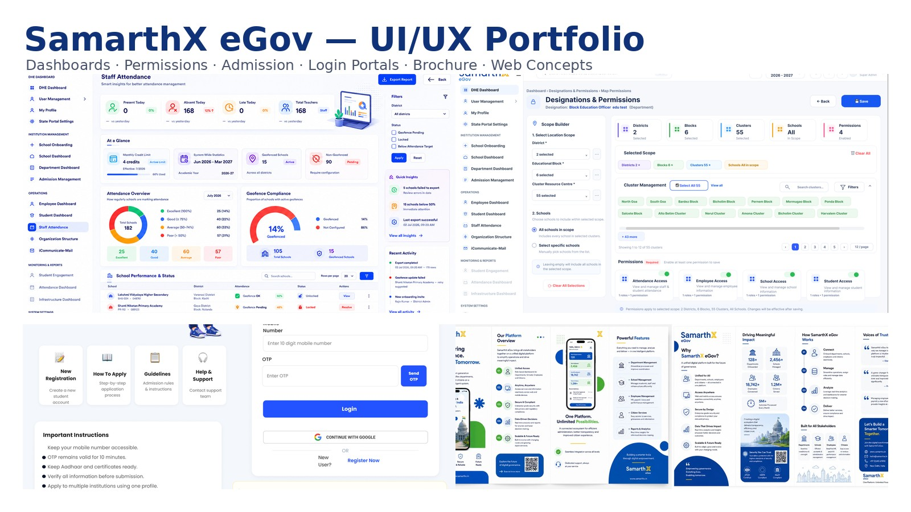

A curated collection of UI/UX work created for the **SamarthX eGov ecosystem**, including administrative dashboards, permission management, student admission, role-based login portals, public-facing website concepts, and an informational brochure.

This repository is structured as a recruiter-friendly visual case study rather than a raw design-file archive.

## Project Snapshot

| Area | Details |
|---|---|
| Role | UI/UX Designer |
| Designer | Krish Garg |
| Platform | Government and education management ecosystem |
| Primary tool | Figma |
| Supporting tools | Adobe Illustrator, Adobe Photoshop |
| Deliverables | Dashboards, forms, workflows, login portals, website concepts, brochure |
| Design direction | Modern, accessible, structured, blue-and-white e-governance UI |

## Design Objectives

- Improve visual hierarchy in information-heavy workflows
- Make administrative data easier to scan and act upon
- Create consistent patterns for different user roles
- Support large geographic and institutional datasets
- Improve first-time applicant access and guidance
- Build a credible but modern government-platform identity
- Prepare polished assets for review and development handoff

---

## 1. Staff Attendance Dashboard

A high-density operational dashboard presenting attendance metrics, geofence compliance, school-level performance, report export, filters, quick insights, and recent activity.

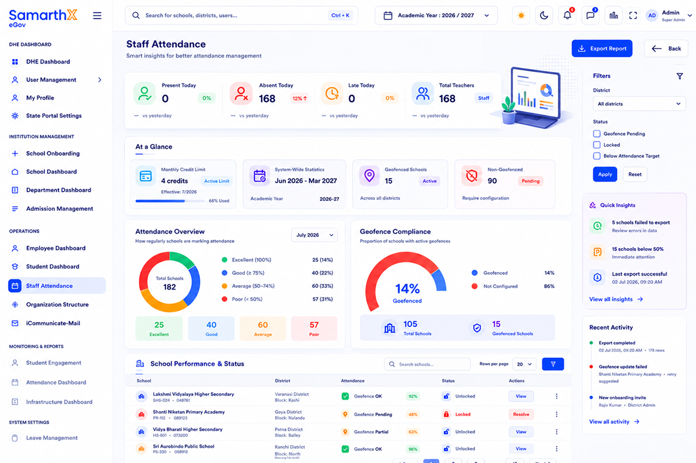

### Highlights

- Clear KPI grouping for present, absent, late, and total staff
- Attendance distribution visualized with status-based categories
- Geofence compliance summary and school-level records
- Persistent filters and export action
- Quick insights and recent activity for faster administration
- Search, row controls, and actions integrated into the data table

---

## 2. Designations and Permissions

A scalable interface for mapping designation permissions across districts, blocks, clusters, schools, and feature groups.

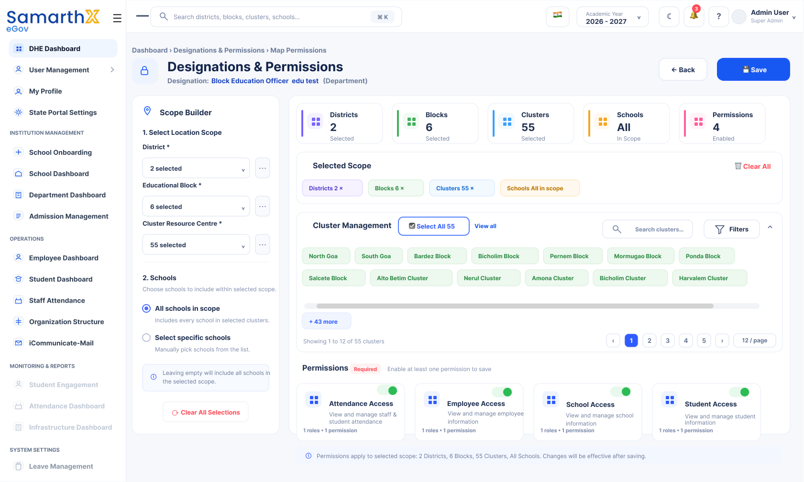

### Highlights

- Progressive geographic scope selection
- Selected-scope chips for visibility and error prevention
- Bulk selection, search, filtering, and pagination
- “All schools” and “specific schools” options
- Modular permission cards with clear enabled states
- Summary metrics for districts, blocks, clusters, schools, and permissions

---

## 3. Student Admission Portal

A first-time applicant-friendly admission experience with mobile OTP login, Google sign-in, registration, application guidance, notices, and important instructions.

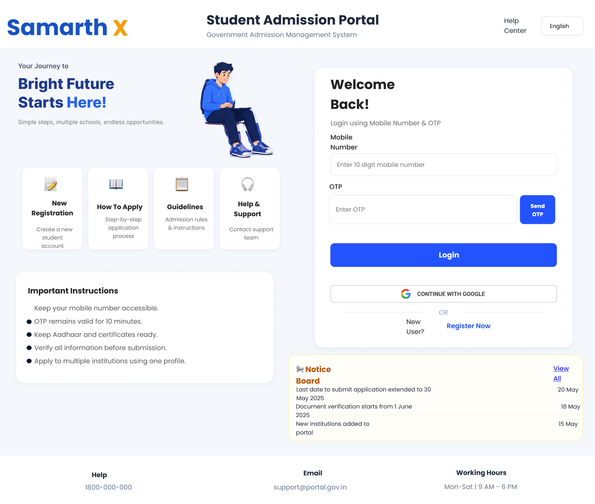

### Highlights

- Registration and guidance available before login
- Mobile number and OTP-based authentication
- Google sign-in option
- Important instructions presented in a dedicated panel
- Notice board integrated into the primary screen
- Strong visual separation between guidance and authentication

---

## 4. Role-Based Login Portals

A consistent login system adapted for schools, employees, and higher-education users.

### School Portal

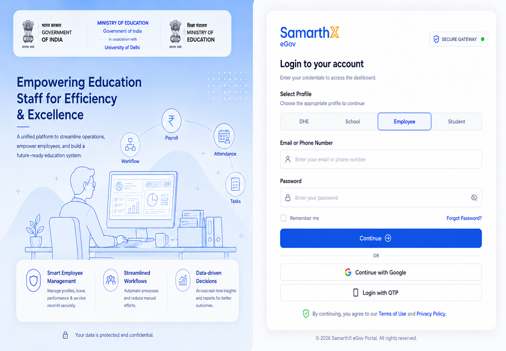

### Employee Portal

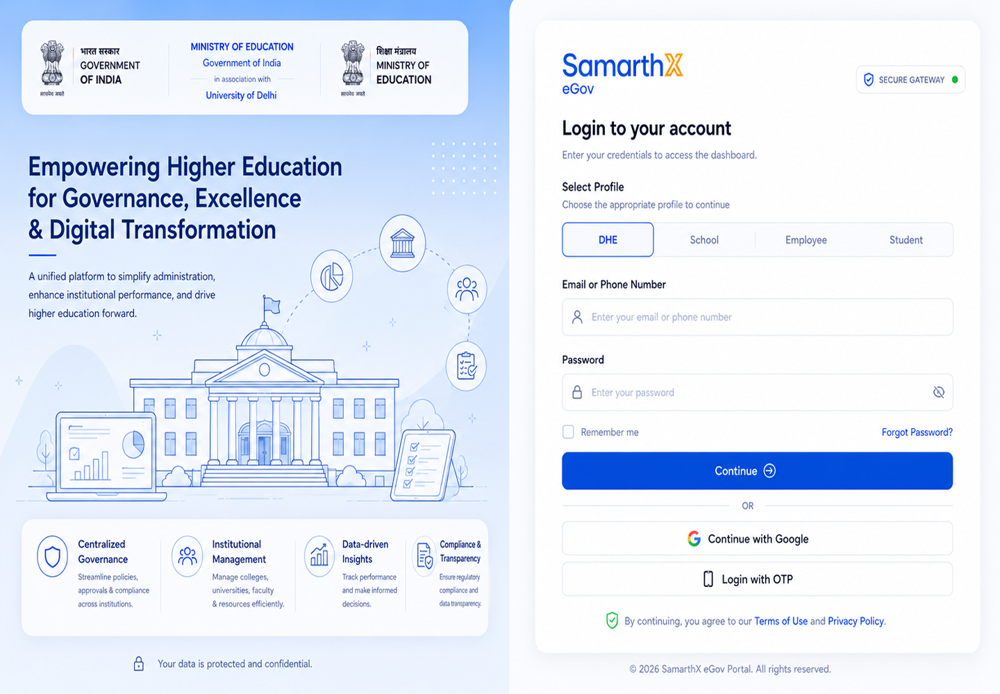

### Higher Education Portal

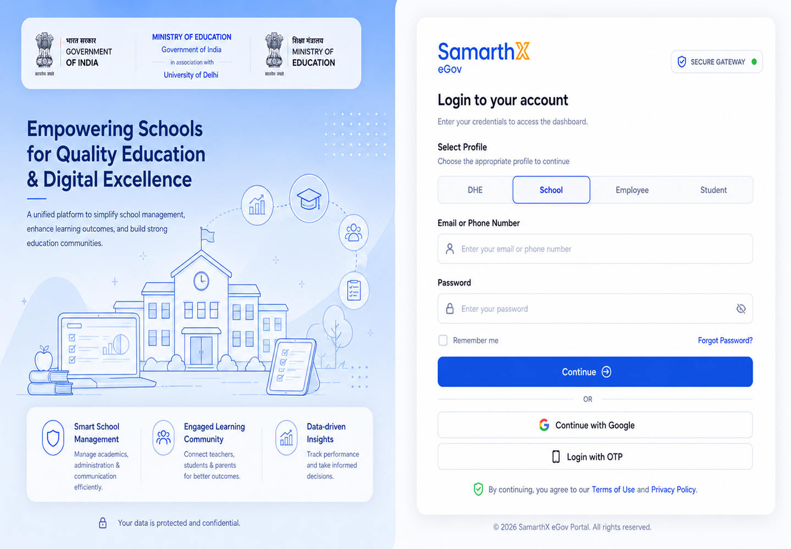

The three variants use a shared authentication pattern while tailoring illustration, messaging, and institutional context to each user group.

---

## 5. SamarthX eGov Brochure

A multi-panel communication design explaining the platform overview, features, impact, workflow, stakeholders, security, and contact information.

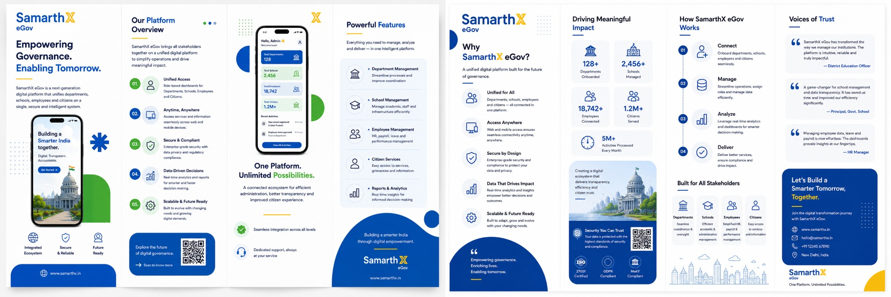

The brochure extends the digital product language into an informational format while maintaining the same visual identity.

---

## 6. Public-Facing Website Concepts

The repository also includes six long-form landing-page explorations for education, governance, and institutional platforms.

| Concept | Preview |
|---|---|
| Dark Digital Governance | [Open full design](designs/web-concepts/dark-digital-governance-landing-page.png) |
| Education Platform | [Open full design](designs/web-concepts/education-platform-landing-page.png) |
| Green Government Platform | [Open full design](designs/web-concepts/green-government-platform-concept.png) |
| Blue eGovernance Platform | [Open full design](designs/web-concepts/blue-egovernance-platform-concept.png) |
| Modern Institution Platform | [Open full design](designs/web-concepts/modern-institution-platform-concept.png) |
| SamarthX Product Landing Page | [Open full design](designs/web-concepts/samarthx-product-landing-page.png) |

### Preview Gallery

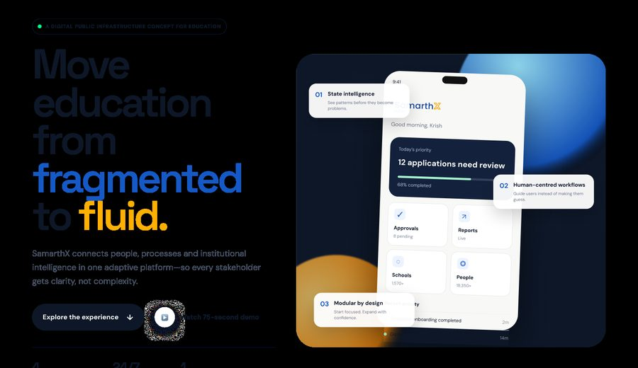
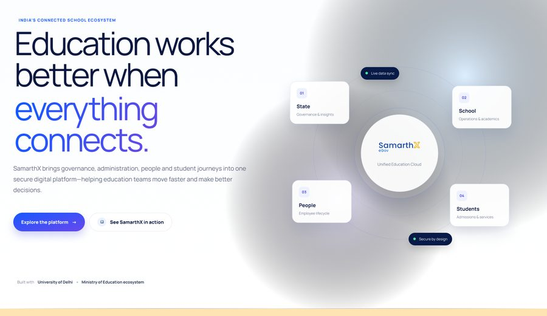
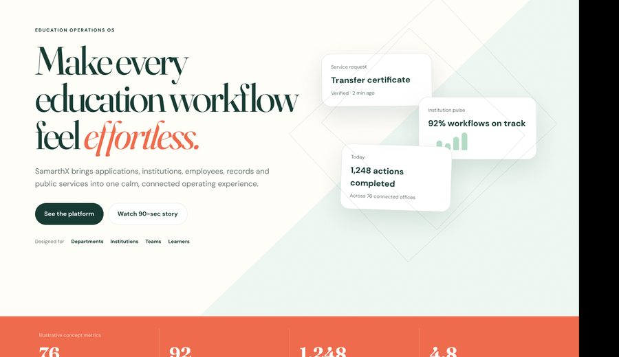
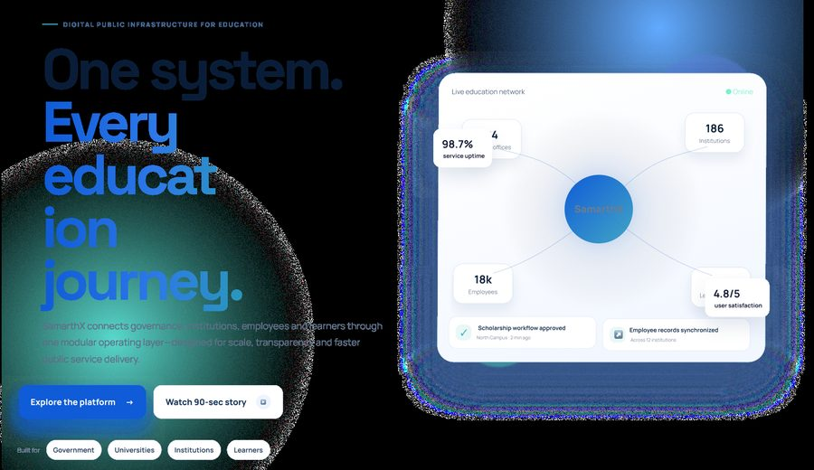
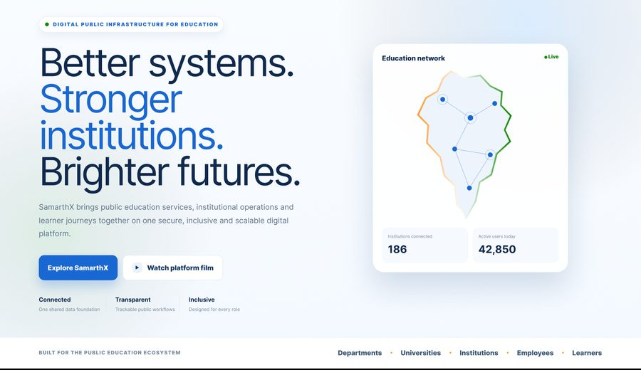
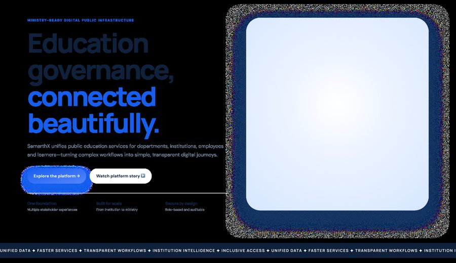

---

## Design Process

1. Requirement analysis
2. User-role and workflow mapping
3. Information architecture
4. Wireframe exploration
5. High-fidelity visual design
6. Component and state refinement
7. Stakeholder feedback and iteration
8. Export preparation and developer handoff

## Key UX Patterns Demonstrated

- Role-based access
- First-time applicant onboarding
- OTP and federated sign-in
- Hierarchical location selection
- Bulk selection and scope summaries
- Permission toggles and cards
- Dashboard analytics
- Filters and pagination
- Status-driven tables
- Responsive visual communication

## Repository Structure

```text
samarthx-egov-portfolio/
├── assets/
│   ├── cover/
│   └── thumbnails/
├── designs/
│   ├── admission-portal/
│   ├── brochure/
│   ├── dashboards/
│   ├── login-portals/
│   ├── permissions/
│   └── web-concepts/
├── source-assets/
├── case-study/
├── README.md
├── LICENSE
└── .gitignore
```

## Case Study Notes

Additional project explanation is available in:

- [Project overview](case-study/project-overview.md)
- [Design decisions](case-study/design-decisions.md)
- [Outcomes and learnings](case-study/outcomes-and-learnings.md)

## Portfolio Links

- **Portfolio:** https://krishgarg.netlify.app
- **GitHub:** https://github.com/krishofficial112-dev
- **Figma Community:** https://www.figma.com/@krishgarg_

## Confidentiality

This repository contains selected portfolio-safe visual work only. It does not include credentials, private user data, internal communication, production databases, or restricted documents.

## Usage Notice

The portfolio presentation, written case study, and repository organization are created by Krish Garg. SamarthX-related names, logos, institutional marks, and third-party assets remain the property of their respective owners. The visual work is shared for portfolio and evaluation purposes.
